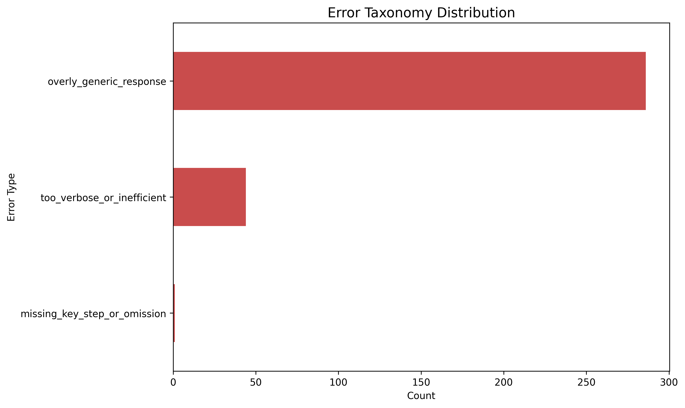
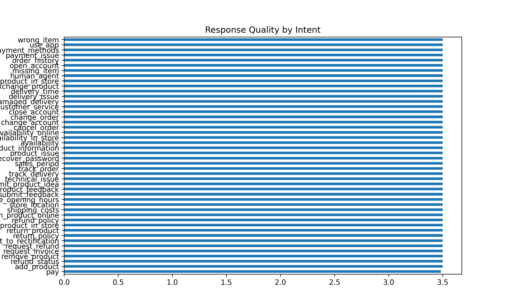
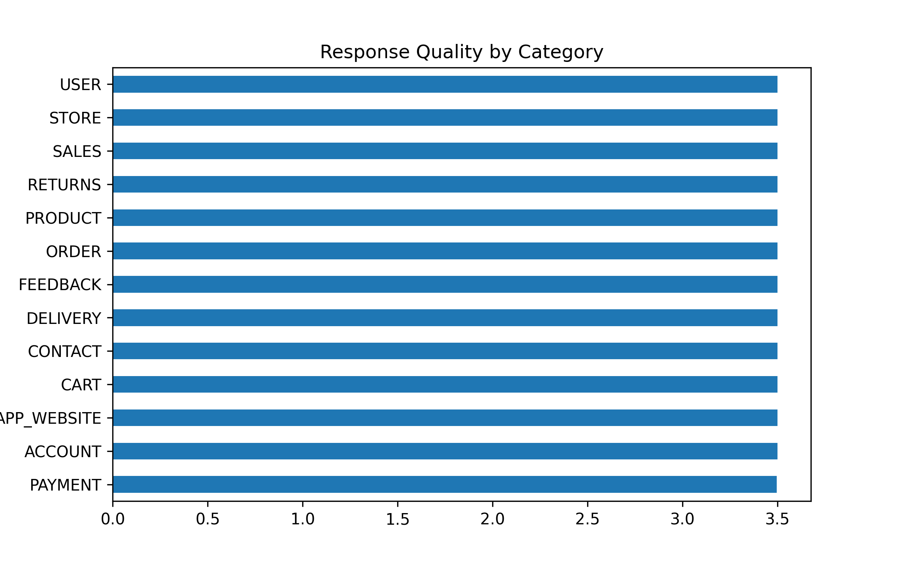

# ai-ecommerce-evaluation-quality
End-to-end AI evaluation project demonstrating how to assess, validate, and improve AI-generated e-commerce outputs using structured rubrics, quantitative analysis, and data quality frameworks.

The project evaluates chatbot interactions, product information, and SEO performance summaries to identify inaccuracies, detect edge cases, and provide evidence-based recommendations for improving AI reliability and business decision-making.
# 🧠 AI Evaluation of E-commerce Chatbot Responses Using Rubric-Based Quality Scoring

## 📌 Overview
This project evaluates the quality of AI-generated chatbot responses in an e-commerce environment using a structured rubric-based scoring framework.

The evaluation combines:
- quantitative scoring  
- error taxonomy analysis  
- targeted manual review  

---

## 🎯 Objectives
- Evaluate chatbot responses across key quality dimensions  
- Identify recurring failure patterns  
- Compare performance across intents and categories  
- Generate actionable AI improvement insights  

---

## 📊 Dataset
- **Bitext Retail & E-commerce Chatbot Dataset**
- Sample size: **390 rows (stratified by category)**
- Fields:
  - prompt  
  - intent  
  - category  
  - ai_response  

---

## ⚙️ Methodology

### ✅ Evaluation Framework
Each response is scored using a **1–5 scale** across:
- Accuracy  
- Relevance  
- Completeness  
- Consistency  
- Business Usefulness  
- Clarity  

---

### ✅ Error Taxonomy
Responses are classified using:
- `overly_generic_response`
- `missing_key_step_or_omission`
- `too_verbose_or_inefficient`

---

### ✅ Workflow
1. Data cleaning and standardisation  
2. Stratified sampling (390 rows)  
3. Semi-automated scoring  
4. Targeted manual review:
   - low-quality responses  
   - edge cases  
   - error clusters  
5. Aggregation and visualisation  

---

## 📈 Visual Analysis

### 📊 Rubric Score Distribution

**Insight:**  
Relevance and Consistency are the strongest dimensions, while Completeness and Business Usefulness are slightly lower — indicating responses are correct but not always fully actionable.

---

### ⚠️ Error Taxonomy Distribution

**Insight:**  
Overly generic responses dominate, followed by verbosity issues, while missing steps are relatively rare. This shows the key issue is **lack of specificity, not correctness**.

---

### 🔍 Response Quality by Intent

**Insight:**  
Performance is consistent across intents, suggesting stable reliability but limited adaptation to different query types.

---

### 🛒 Response Quality by Category

**Insight:**  
Quality remains stable across categories, reinforcing that the chatbot is reliable but not highly optimised for category-specific context.

---

### ⚡ Edge Case Analysis

## ⚡ Edge Case Examples

| Prompt | Intent | Category | Error Type | Evaluation Summary | Improvement Recommendation |
|------|--------|----------|------------|-------------------|---------------------------|
| "I want to add product to cart now!!!" | add_product | CART | overly_generic_response | Response is relevant but uses standardised phrasing and lacks specific guidance. | Provide clearer, step-based instructions tailored to user context. |
| "why haven't I received my order???" | track_order | DELIVERY | overly_generic_response | Response acknowledges the issue but remains generic and does not guide next steps effectively. | Include actionable steps such as checking tracking details or contacting support. |
| "refund me right now this is unacceptable" | request_refund | PAYMENT | overly_generic_response | Response remains polite and aligned with intent but lacks urgency and targeted resolution steps. | Provide clear refund process steps and priority escalation guidance. |
| "where is my stuff and when will it come" | track_delivery | DELIVERY | overly_generic_response; missing_key_step_or_omission | The answer addresses delivery but omits steps for tracking or resolving delays. | Add tracking instructions and expected timelines. |
| "can I change my order and refund it?" | change_order | ORDER | overly_generic_response | Multi-intent request handled partially; response does not clearly separate actions. | Break into structured steps addressing both change and refund processes. |
| "do u guys even know my problem?" | customer_service | GENERAL | overly_generic_response | Response is polite but fails to address the implied frustration and unclear request. | Ask clarifying questions before giving a generic response. |
| "I need help ASAP with my payment issue" | payment_issue | PAYMENT | overly_generic_response | Response is relevant but lacks urgency handling and detailed troubleshooting steps. | Provide step-by-step troubleshooting and escalation options. |
| "I want to return but I don't know how" | return_product | RETURNS | missing_key_step_or_omission | Response acknowledges return request but does not provide clear instructions. | Include detailed return procedure and necessary conditions. |
| "help me order product now quickly" | place_order | ORDER | overly_generic_response | Response is correct but too generic and not adapted to urgency. | Provide direct quick-order steps and shortcuts. |
| "why is this product out of stock again?" | product_availability | INVENTORY | overly_generic_response | Response explains stock issue but lacks meaningful explanation or alternatives. | Suggest restock timelines or alternative products. |

**Insight:**  
> These edge-case examples demonstrate that while the chatbot maintains correctness and tone under difficult conditions, it frequently defaults to generic responses instead of context-aware, action-oriented guidance.
The chatbot handles difficult prompts (e.g., rude or ambiguous queries) effectively, but still produces generic responses instead of context-aware answers.

---

## 💡 Key Insight

> The chatbot performs reliably but lacks optimisation.  
> The primary limitation is not correctness, but insufficient specificity and contextual awareness.

---

## 🏢 Business Implications

- ✅ Reliable for customer support  
- ⚠️ Generic responses may reduce:
  - user trust  
  - satisfaction  
  - perceived intelligence  
- ⚠️ Potential negative impact on e-commerce conversion  

---

## 🚀 Recommendations

- Improve response specificity  
- Reduce template-based outputs  
- Enhance completeness in transactional workflows  
- Introduce intent-aware response tuning  
- Optimise response length and clarity  

---

## ⚠️ Challenges & Solutions

| Challenge | Solution |
|----------|---------|
| Small initial sample | Used 390 stratified sample |
| No errors detected initially | Improved error detection logic |
| Notebook execution issues | Structured pipeline + run-all |
| Weak initial visuals | Expanded dataset coverage |
| Auto-scoring limitations | Added targeted manual review |

---

## 🔧 What I Would Improve Next

- Extend evaluation to additional datasets  
- Add inter-rater agreement checks  
- Refine error taxonomy  
- Build scoring interface  
- Compare auto vs manual scoring  
- Add KPI-based evaluation extension  

---

## 🛠 Tools Used

- Python (pandas, numpy)  
- Matplotlib / Seaborn  
- Jupyter Notebook  

---

## 📂 Project Structure
